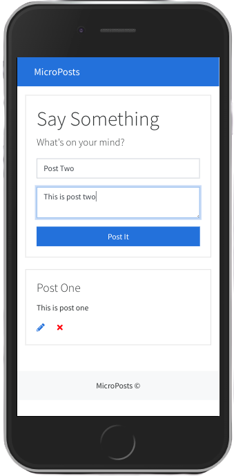
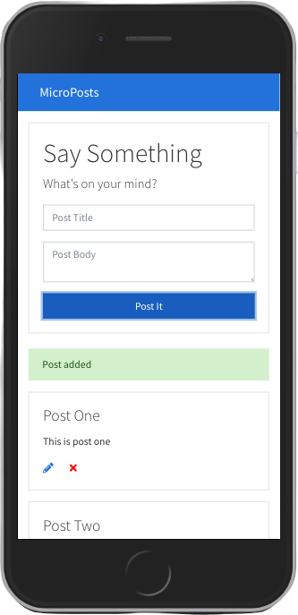
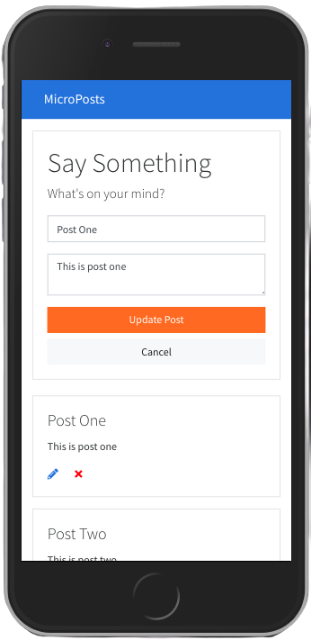
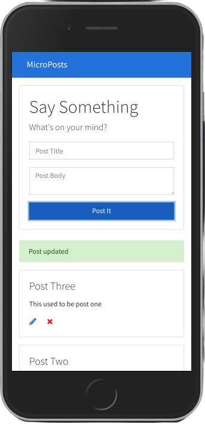

# MicroPosts

#### _June 2020_

#### By _**Marc Davies**_

# Table of Contents

<!--ts-->

- [Description](#description)
- [Technologies Used](#technologies-used)
- [Setup and Installation](#setup-and-installation)
- [Known Bugs](#known-bugs)
- [Support And Contact Details](#support-and-contact-details)
<!--te-->

## Description

Front-end CRUD app using Vanilla JS mimicking a social media platform where users can add, edit and delete posts.

## Technologies Used

- _HTML 5_
- _Bootstrap 4.5.0_
- _Babel 7.4.3_
- _Webpack 4.16.1_
- _json-server 0.16.1_

## Setup and Installation

- Launch your terminal.
- `cd desktop` Navigate to the desktop.
- `git clone "https://github.com/MarcLignarius/JS.MicroPosts"` Clone this repository to your desktop.
- `cd JS.MicroPosts` Open up the cloned repository.
- `npm install` This will allow the viewer of this project to have access to the CLI (command line interface) for webpack.
- `npm run start` to launch the app which will be hosted at http://localhost:8080/.
- `npm run json:server` to start the JSON server and display sample data.

## User Stories

### Adding A Meal

|        Adding A Post         |          Post Added          |
| :--------------------------: | :--------------------------: |
|  |  |

### Editing A Post

|        Editing a Post        |         Post Edited          |
| :--------------------------: | :--------------------------: |
|  |  |

## Known Bugs

There are no known bugs as of that last release.

## Support and Contact Details

Please contact me via <a href="https://www.linkedin.com/in/marcdaviesriot/">LinkedIn</a> if you have any questions. Your feedback is always welcomed!

Copyright (c) 2020 **_Marc Davies_**
